<p align="center">
  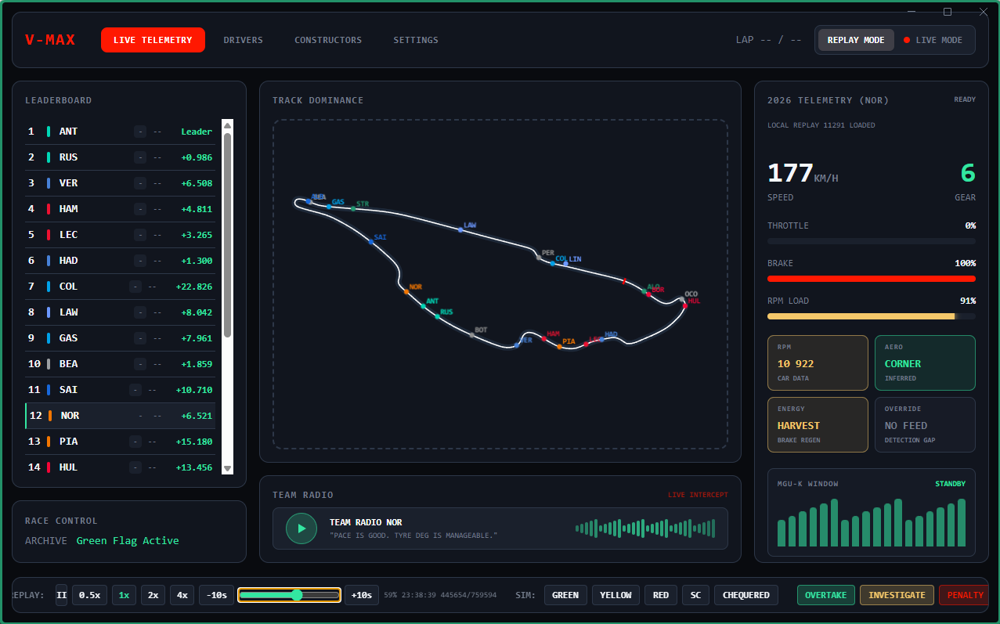
</p>

<h1 align="center">
  <span style="color:#FF1801">V</span>-MAX
</h1>

<p align="center">
  <strong>Real-time Formula 1 telemetry dashboard</strong><br>
  <sub>Live timing · Car telemetry · Track visualization · Session replay</sub>
</p>

<p align="center">
  
  
  
  
  
  
</p>

---

## 🏎️ What is V-Max?

V-Max is a desktop application that connects to official F1 live timing data and renders it as a broadcast-quality telemetry dashboard. Watch races with real-time car data, track positions, and leaderboard — or replay past sessions from local archives.

> ⚠️ **Alpha stage** — Under active development. Things may break, features may change.

---

## ✨ Features

<table>
<tr>
<td width="50%">

### 📡 Live Mode
- Real-time connection to **F1 SignalR** live timing
- WebSocket stream with auto-reconnect
- `CarData.z` / `Position.z` decompression
- Track status flags (🟢🟡🔴 SC/VSC/Chequered)

</td>
<td width="50%">

### 🔁 Replay Mode
- Load sessions from local JSON archives
- Play / Pause / Seek / Jump ±10s
- Adjustable speed: 0.5x → 4x
- Auto-fetch missing data from OpenF1 API

</td>
</tr>
<tr>
<td>

### 🗺️ Track Map
- SVG circuit rendering (Multiviewer API)
- Fallback GPS track path generation
- Interpolated car positions (smooth movement)
- Color-coded team dots with driver labels

</td>
<td>

### 📊 Telemetry Panel
- Speed, Gear, Throttle, Brake — real-time
- RPM load estimation
- Aero mode detection (Corner/Straight/Transition)
- MGU-K energy flow visualization

</td>
</tr>
<tr>
<td>

### 🏁 Leaderboard
- Real position data from OpenF1
- Interval gaps to leader
- Click any driver to focus telemetry
- Team color coding

</td>
<td>

### 🎮 Race Control
- Flag simulation (Green/Yellow/Red/SC/Chequered)
- Popup notifications (Penalty/Investigation/Overtake)
- Party mode animation on Chequered flag 🎉

</td>
</tr>
</table>

---

## 📸 Gallery

<p align="center">
  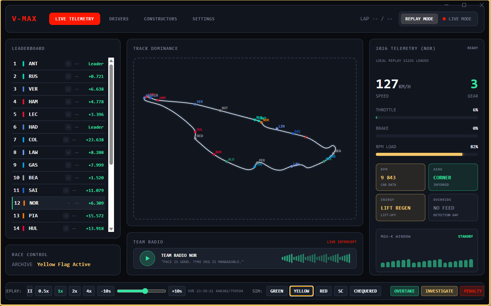
  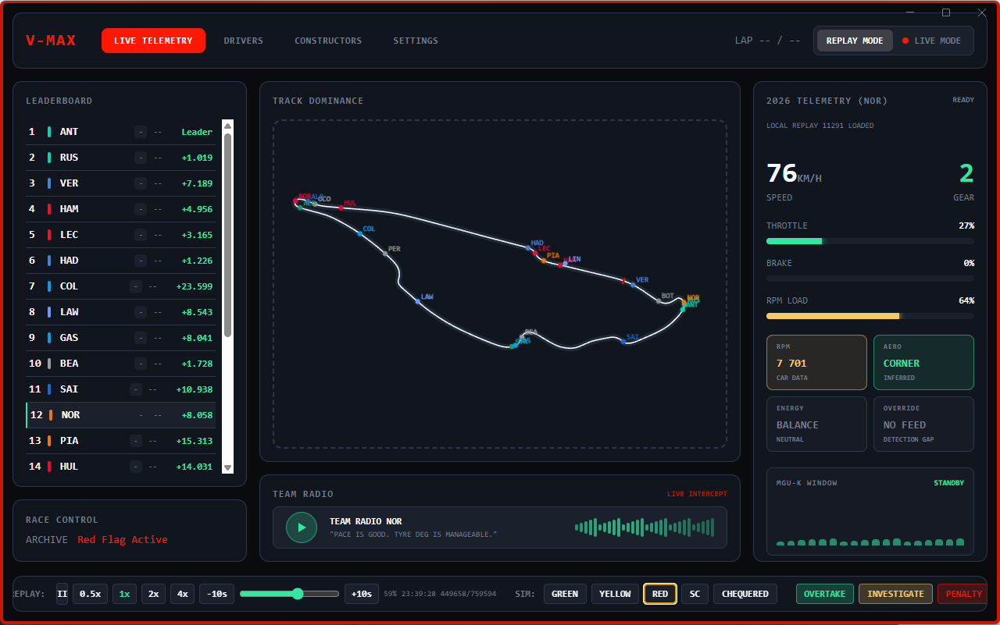
</p>
<p align="center">
  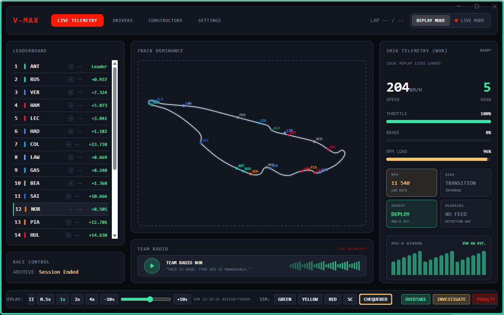
  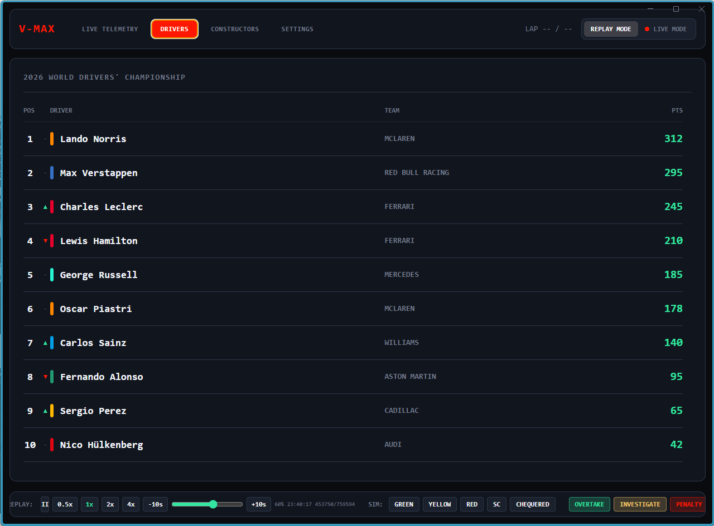
</p>
<p align="center">
  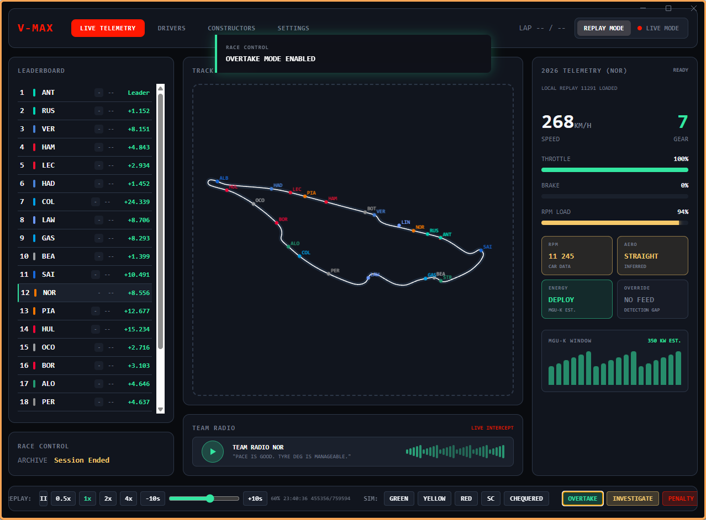
  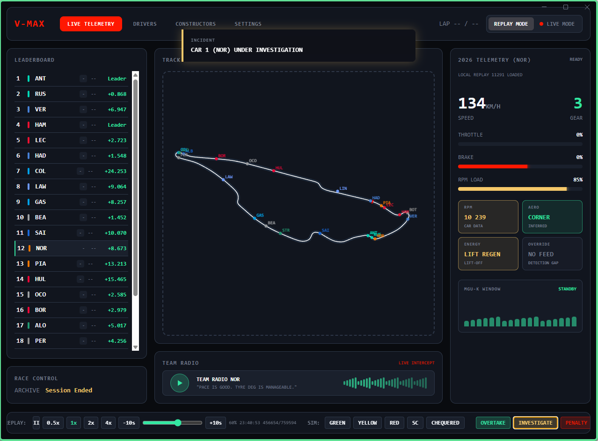
</p>
<p align="center">
  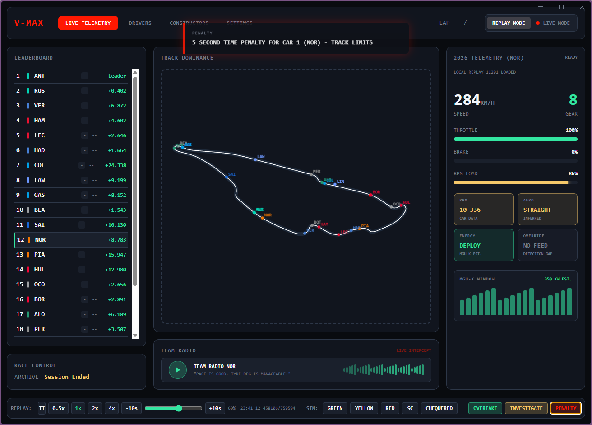
  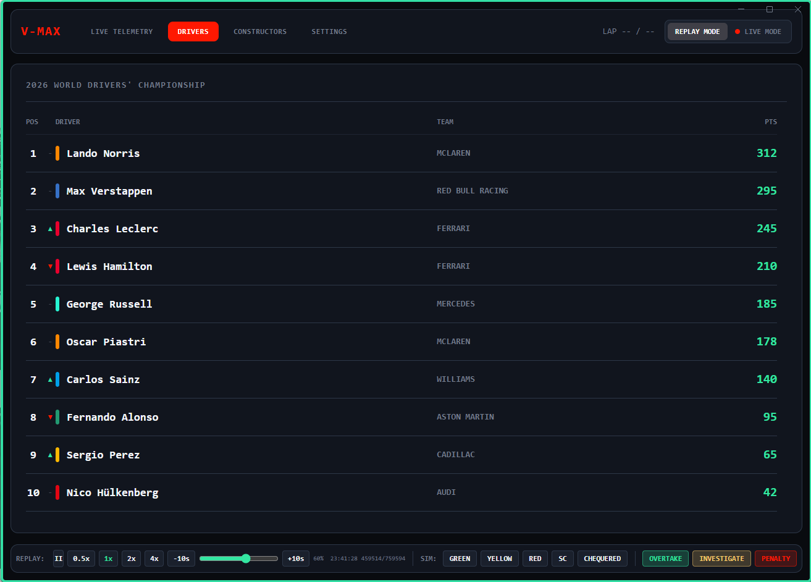
</p>
<p align="center">
  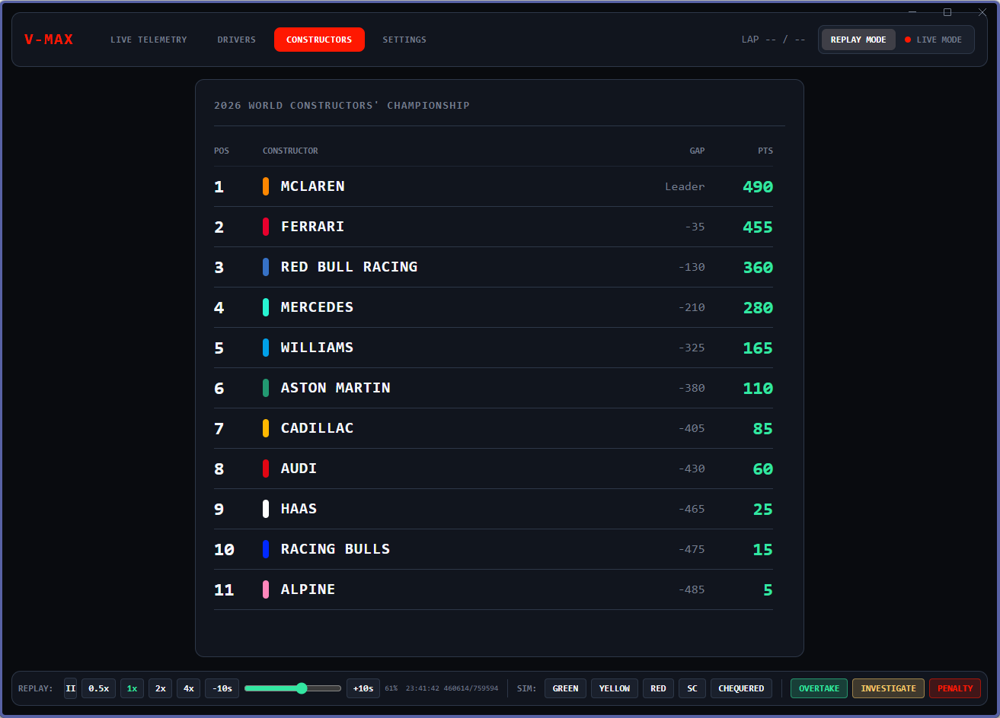
  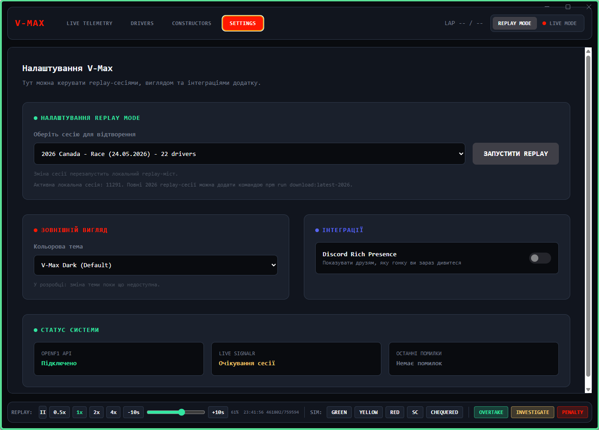
</p>

---

## 🖥️ Tech Stack

| Layer | Technology |
|-------|-----------|
| Desktop Runtime | Electron 42 |
| Frontend | React 19 + TypeScript 6 |
| Styling | Tailwind CSS v4 (Vite plugin) |
| Bundler | Vite 8 |
| Live Data | WebSocket → F1 SignalR |
| Replay Data | Local JSON + OpenF1 API |
| Track Maps | Multiviewer API + GPS fallback |

---

## 🚀 Quick Start

```bash
# Clone the repo
git clone https://github.com/your-username/V-Max.git
cd V-Max

# Install dependencies
npm install

# Run in development mode (Vite + Electron)
npm start
```

The app starts in **Replay Mode** by default. Place session data in `library/<session_key>/` with these files:
```
library/
└── 11291/
    ├── drivers.json       # Driver list
    ├── car_data.json      # Telemetry records
    ├── location.json      # GPS positions
    ├── session.json       # Session metadata (optional)
    ├── position.json      # Race positions (auto-fetched if missing)
    └── intervals.json     # Gap intervals (auto-fetched if missing)
```

---

## 🏗️ Architecture

```
┌─────────────────────────────────────────────────┐
│                  Electron Main                   │
│                                                  │
│  ┌──────────────┐    ┌───────────────────────┐  │
│  │ LiveF1Bridge │    │    LocalF1Bridge       │  │
│  │  (SignalR)   │    │  (JSON replay engine)  │  │
│  └──────┬───────┘    └──────────┬────────────┘  │
│         │     IPC: f1-data      │               │
│         └──────────┬────────────┘               │
└────────────────────┼────────────────────────────┘
                     │ contextBridge
┌────────────────────┼────────────────────────────┐
│              React Renderer                      │
│                    │                             │
│  useRaceData ──→ raceState (reducer)             │
│       │                                          │
│  ┌────┴─────┬──────────┬──────────┐             │
│  │ TrackMap  │ Telemetry│Leaderboard│            │
│  │  (SVG)   │  Panel   │  Panel    │            │
│  └──────────┴──────────┴──────────┘             │
└──────────────────────────────────────────────────┘
```

---

## 📋 Roadmap

- [x] Replay engine with binary search & time-based ticking
- [x] Driver focus system (click to switch telemetry)
- [x] Real leaderboard from position data
- [x] GPS-based track path fallback
- [x] Interpolated car movement on map
- [x] RPM / Aero / Energy estimation panels
- [ ] Lap counter integration
- [ ] DRS indicator
- [ ] Tyre strategy visualization
- [ ] Weather widget
- [ ] Theme system (Dark / Neon / Papaya)
- [ ] Discord Rich Presence
- [ ] Championship standings from live data
- [ ] Electron app packaging & distribution

---

## 📄 License

This project is not affiliated with Formula 1, FIA, or any F1 team. All F1-related trademarks belong to their respective owners. Data sourced from publicly available F1 live timing feeds and the [OpenF1 API](https://openf1.org).

---

<p align="center">
  <sub>Built with 🏁 and too much coffee</sub>
</p>
