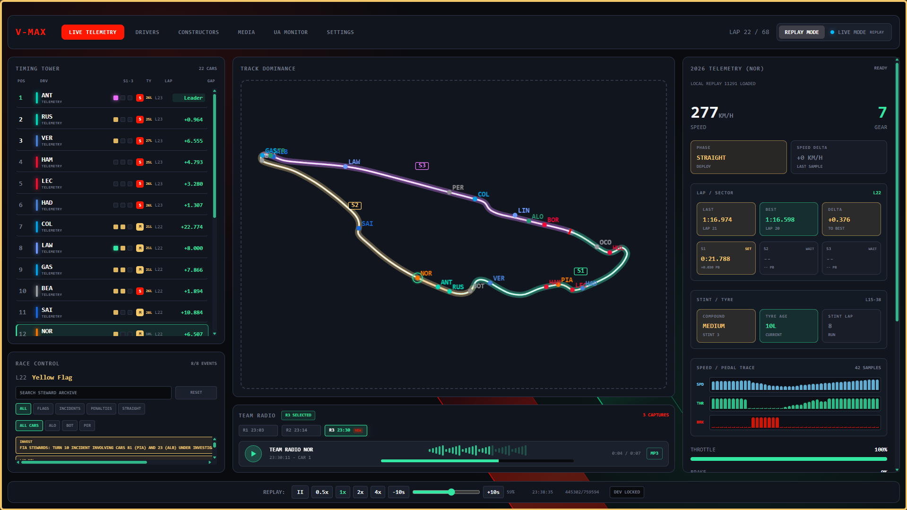
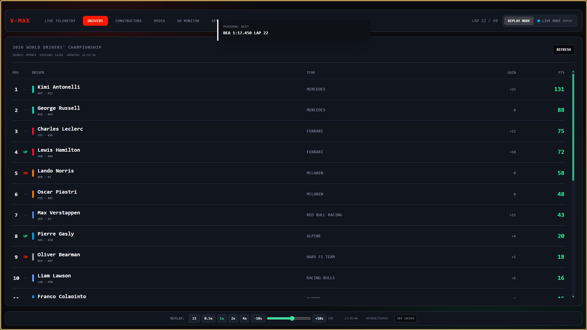
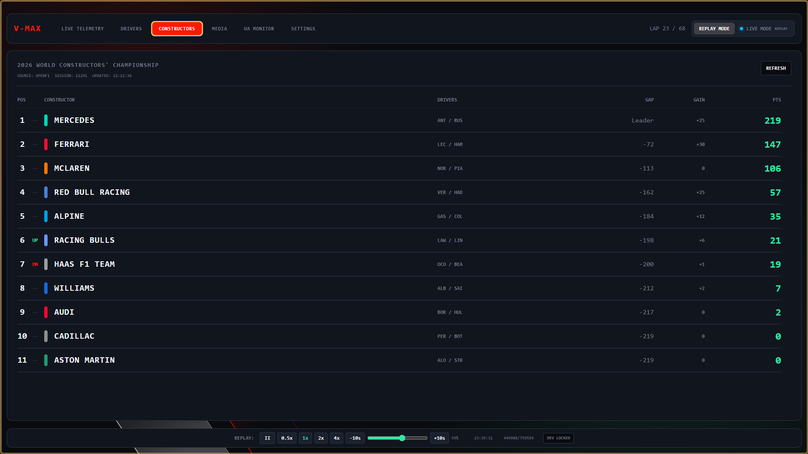
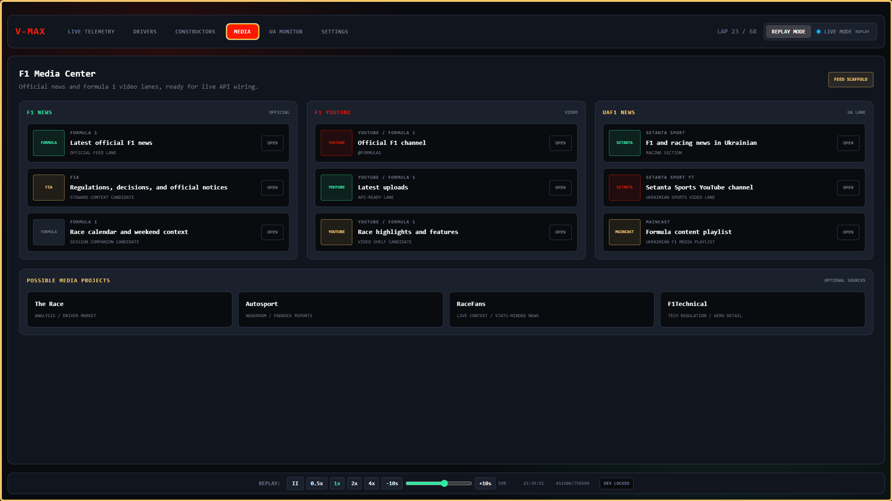
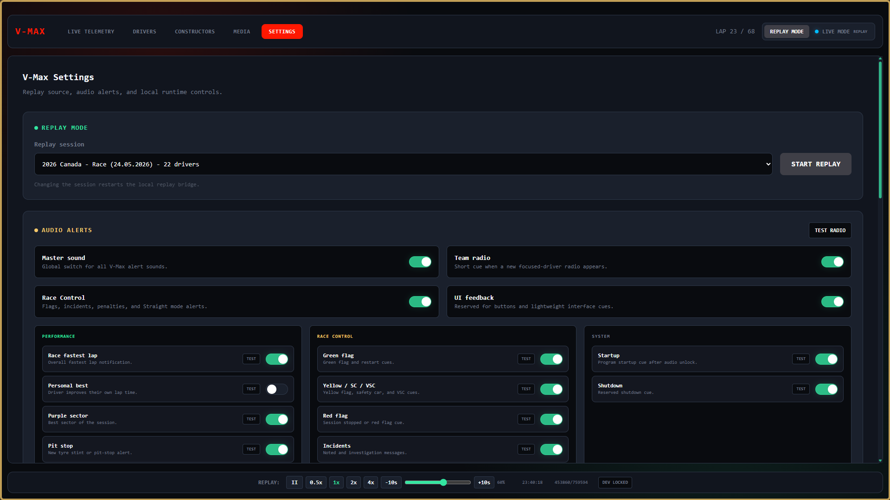
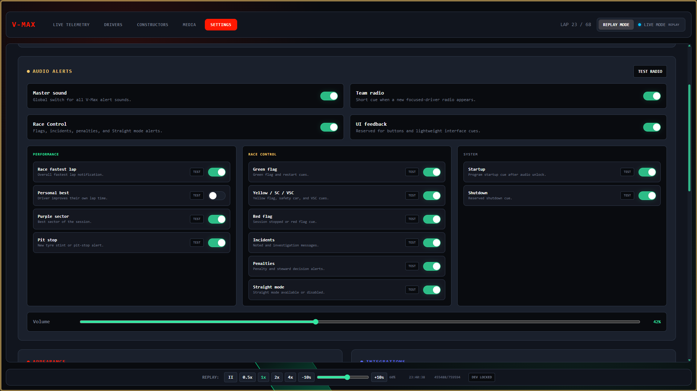
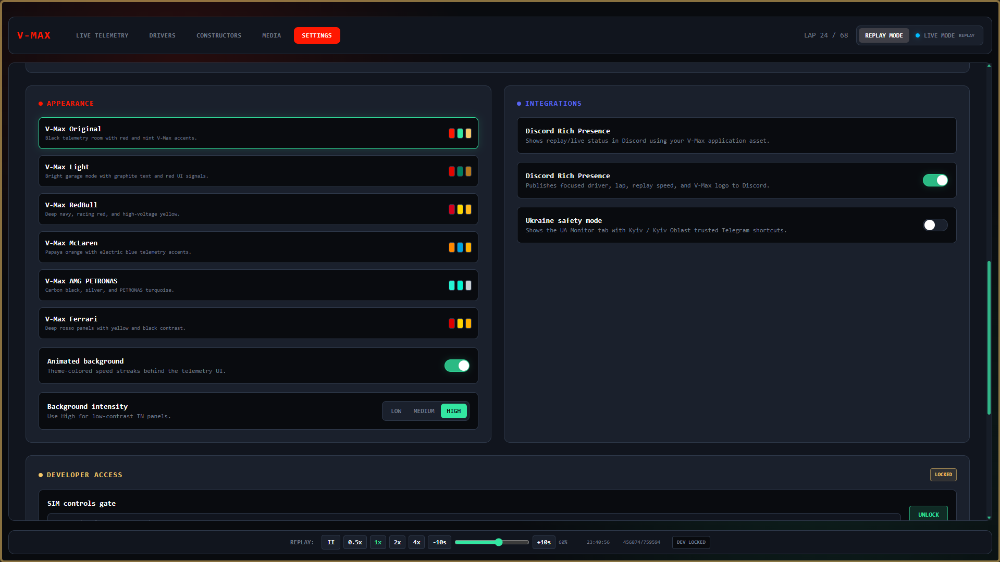
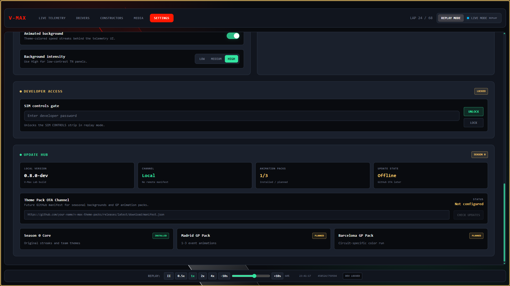

# V-Max Development Update

## Milestone

**Window:** 2026-05-28 22:00 - 2026-05-29 22:21  
**Duration:** roughly 24 hours  
**Repository age at QA freeze:** roughly 11 hours after GitHub repository creation  
**Freeze backup:** `E:\V-Max\V-Max_lab_backup_11.zip`

## Summary

V-Max moved from an early telemetry prototype into a working F1 dashboard build with replay playback, driver tracking, race-control context, team radio, theming, media links, Ukraine safety shortcuts, Discord Rich Presence, and a completed QA smoke pass.

## Major Work Completed

- Built a stable replay flow around local OpenF1 session data.
- Added focused-driver telemetry with speed, gear, throttle, brake, RPM, lap/sector, stint/tyre, weather, and speed/pedal traces.
- Reworked the timing tower with sectors, tyre compound, tyre age, lap, gaps, and focused-driver highlighting.
- Fixed replay driver movement, interpolation, map positioning, and leaderboard ordering across the session.
- Added race-control archive filters, search, priority messages, driver labels, and TLA-aware filtering.
- Added team radio archive, playback UI, radio selection, visual/audio notifications, and focused-driver radio handling.
- Added sound packs and granular sound settings with test buttons.
- Added V-Max themes, animated theme backgrounds, and a high-visibility mode for low-contrast displays.
- Added Media tab with F1 news, F1 YouTube, and UAF1 News sources.
- Added UA Monitor tab gated behind Ukraine safety mode with Kyiv / Kyiv Oblast Telegram shortcuts.
- Added Discord Rich Presence with V-Max asset, replay state, focused driver, lap, and speed.
- Added developer SIM controls behind a local UI password gate.
- Added app launcher script for easier startup.

## QA Status

- **Smoke:** OK
- **Replay Core:** OK
- **Panels:** OK
- **Settings:** OK
- **Known Visual Fix Later:** OK

## Human Cost / Field Notes

Consumed: three packs of sticks (NEO red&blue - 1, KENT Aqua - 1, NEO yellow - 1), two Monster Energy cans (one white Ultra and one VR46), and the developer's nerves.

Nights survived: 1.

Air attacks endured: 7, if memory is not lying, because there were way too many in one day.

## Current Stable Features

- Replay mode with play, pause, seek, jump, and speed controls.
- Live/replay status indicator.
- Track map with moving drivers, sector overlays, selected-driver highlight, and driver trails.
- Timing tower with broadcast-style compact driver rows.
- Telemetry panel 2.x with lap/sector, tyre, weather, MGU-K estimate, phase, speed delta, and traces.
- Race Control archive with filters/search.
- Team Radio archive and playback.
- Sound settings by event type.
- Theme selection and animated backgrounds.
- Media and UA Monitor utility tabs.
- Discord Rich Presence integration.

## Screenshots

UA Monitor screenshots are intentionally excluded from this public update because the current MVP is Kyiv / Kyiv Oblast-specific. It should only be shown publicly after more regions are supported and the feature no longer points at the developer's local safety profile.

### Telemetry Dashboard

### Timing / Race Control / Radio

### Telemetry Detail

### Media Center

### Settings

### Theme / Visual Settings

### Discord Rich Presence

### Additional UI State

## Backup Notes

The QA freeze backup excludes `node_modules`, `.git`, and runtime `.log` files. It includes source code, Electron files, public assets, local replay library, built `dist`, config files, and package files.

## Next Work

- Final visual fix pass for map sector labels and sector overlay readability.
- Optional pit history / pit window layer.
- Optional real Media feed fetching through Electron bridge.
- Optional richer Discord RPC states for formation lap and live mode.
- Optional export/import settings.
